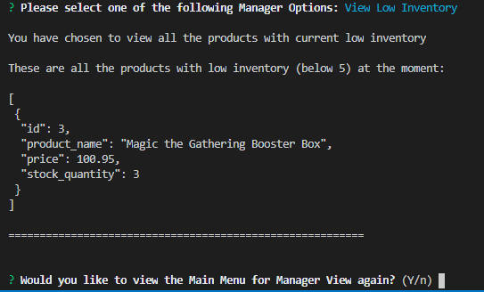

# Bamazon

## Overview

Amazon-like storefront using MySQL and Node.js. The app takes in orders from customers and depletes stock from the store's inventory.  This application uses the MySQL and Inquirer npm packages.

## Instructions

### Customer View

1. From your Terminal, run the Node application called `bamazonCustomer.js`. Running this application will first display all of the items available for sale. Including the products' ids, names, and prices.

2. The app prompts the users with two messages:

    * The first asks them the ID of the product they would like to buy.
    * The second message asks how many units of the product they would like to buy.

3. Once the customer has placed the order, the app checks if the store has enough of the product to meet the customer's request.

    * If not, the app cancells the order due to  `Insufficient quantity!`, and then prevents the order from going through.

4. However, if the store _does_ have enough of the product, the app fulfills the customer's order.
    * It updates the SQL database to reflect the remaining quantity.
    * Once the update goes through, it shows the customer the information, including the total cost of their purchase.
    
5. Finally the app prompts the user again to see if they wish to continue shopping or if they are done.

### Screenshots of the app in action

When you run 'bamazonCustomer.js' you get this:

Then as a customer, you can select which item you want by ID and the quantity you want:

If your purchase was a success then you can add either get another item or just be done shopping:

If for some reason the item is low on stock your order will be automatically cancelled:

Here is your view when using the 'bamazonManager.js':

Select different Manager options:

Add to your Inventory if something is low:

Or you can add a new product you wish to be sold:

### Technologies Used

* JAVASCRIPT
* jQuery
* Node 
* MySQL
* Node Packages
* JSON

